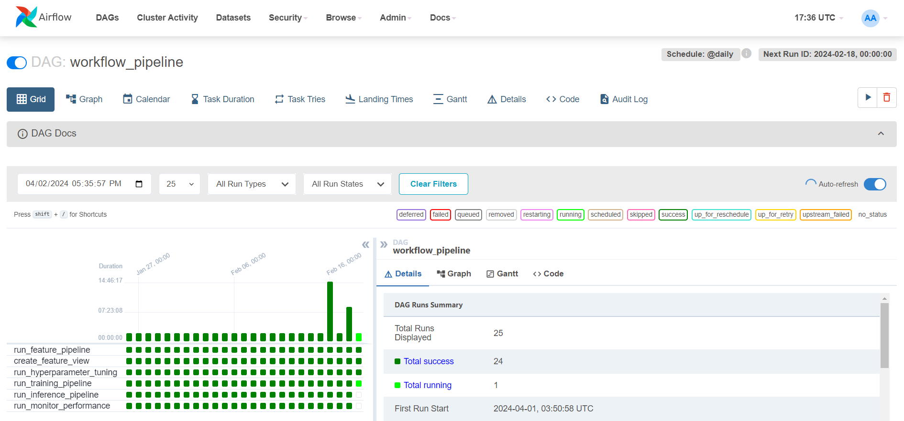
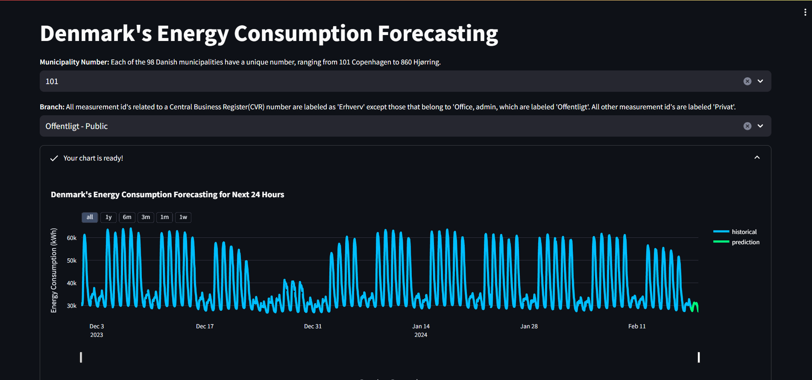
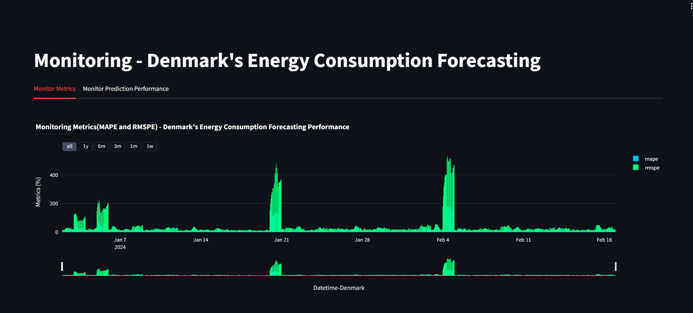
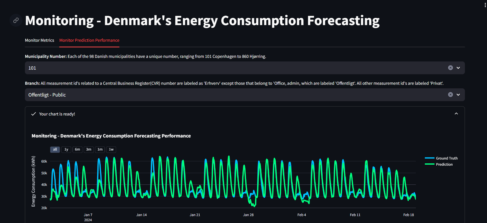
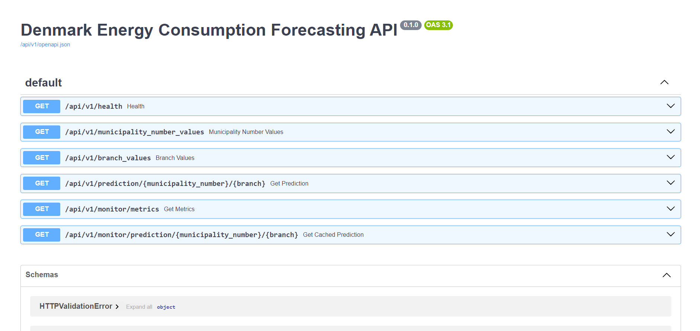

# Denamrks Energy Consumption Forecasting

Click the following options to see it in action:
* [Web Application](http://34.93.41.229:8501/)
* [Monitoring Web App](http://34.93.41.229:8502/)


---

**Table of Contents:**
* [Introduction](#introduction)
* [Overview](#overview)
* [Project Structure](#project-structure)
  * [Feature Pipeline](#feature-pipeline)
  * [Training Pipeline](#training-pipeline)
  * [Inference Pipeline](#inference-pipeline)
  * [Airflow - ML Pipeline Workflow](#airflow---ml-pipeline-workflow)
  * [Web Application](#web-application)
* [Deployment](#deployment)
  * [Setting up the Google Cloud Platform](#setting-up-the-google-cloud-platform)
  * [Deploying Apache Airflow - ML Pipeline](#deploying-apache-airflow---ml-pipeline)
  * [Deploying Web Application](#deploying-web-application)
  * [Continuous Deployment](#continuous-deployment)
* [Conclusion](#conclusion)

## Introduction
Denmark, known for its commitment to renewable energy, particularly wind, solar, and biomass power, faces unique challenges in managing its electricity grid due to the intermittency of wind, solar, and biomass resources. Accurate forecasting of electricity consumption is crucial for optimizing the integration of renewable energy sources into the grid, ensuring the energy supply's stability, reliability, and cost-effectiveness. This project focuses on implementing an MLOps workflow for electricity consumption forecasting in Denmark. It aims to leverage machine learning techniques to develop advanced forecasting models capable of capturing Denmark's complex dynamics of electricity consumption. This project contributes to the efficient management of energy resources, reduction of greenhouse gas emissions, and advancement of sustainable energy practices.

## Overview
* **Problem Statement:** Develop a machine learning pipeline to forecast Denmark's electricity consumption accurately for all the municipalities and different branches on an hourly basis.
* **Approach:** Utilizing the historical consumption data, and advanced machine learning algorithms to build predictive models capable of capturing complex consumption patterns.
* **Technologies/Tools/Packages Used:**
  1. **Python** - Core development
  2. **Pandas** - Data manipulation
  3. **LightGBM** - Modeling
  4. **sktime** - Time series analysis and modeling
  5. **Optuna** - Hyperparameter tuning
  6. **Weights and Biases** - Experiment tracking and model registry
  7. **Hopsworks.ai** - Feature store and Model registry
  8. **Google Cloud Platform** - Cloud storage and Virtual machine
  9. **PyPIserver** - Private PyPI server
  10. **Apache Airflow** - ML workflow management
  11. **FastAPI** - Backend server API
  12. **Streamlit** - Web application deployment
  13. **Docker** - Containerize Airflow and Web applications
  14. **Github Actions** - Continous deployment
* **Workflow:** The project follows an end-to-end MLOps pipeline, encompassing data collection, preprocessing, feature engineering, model training, deployment, and monitoring. Each stage is meticulously designed to ensure the robustness, scalability, and maintainability of the solution.

## Project Structure


Note: The project is dependent on environment variables and secret JSON files. You can find the environment file format named `.env.format` and the JSON files are provided by GCP service accounts.
These files need to be in two directories, for airflow:
```
secrets/airflow/airflow.env
secrets/airflow/service_account_key.json
```
and for web applications:
```
app/secrets/app/app.env
app/secrets/app/service_account_key.json
```

### Feature Pipeline
The feature pipeline consists of several preprocessing and feature engineering steps aimed at extracting meaningful insights from the raw data. Raw data is extracted from the Denmark energy system which is a free and open data portal website, you can click [here](https://www.energidataservice.dk/tso-electricity/ConsumptionIndustry) to visit the website. Once the data is pulled, then it is transformed and validated then later loaded into the feature group within the feature store, this completes the ETL process. Additionally, a feature view is created which contains the training dataset for the next stages.

Feature pipeline command:
```
python energy_consumption_forecasting/feature_pipeline/feature_pipeline.py -s 2021-01-01 -e 2023-12-31
```
Feature view command:
```
python energy_consumption_forecasting/feature_pipeline/feature_view.py -s 2021-01-01 -e 2023-12-31
```

### Training Pipeline
The training pipeline utilizes LightGBM for model training, with sktime's naive forecasting serving as a baseline. Hyperparameter tuning and model evaluation are performed within the workflow to optimize model performance. The workflow ensures that the trained models are reproducible and deployable for batch predictions.

Hyperparameter tuning command:
```
python energy_consumption_forecasting/training_pipeline/hyperparameter_tuning.py --n_trials 20 --fh 24
```

Training pipeline command:
```
python energy_consumption_forecasting/training_pipeline/training_pipeline.py \
--fh 24 --model_type lightgbm --model_name lightgbm_model --model_ver 1
```

### Inference Pipeline
The inference pipeline utilizes the trained model stored in the model registry, with the latest model, prediction is performed depending on the forecasting horizon. The resulting prediction and ground truth data are saved in the Google Cloud Storage and along with that the performance metric is calculated and stored in the storage.

Inference pipeline command:
```
python energy_consumption_forecasting/inference_pipeline/inference_pipeline.py \
-s 2021-01-01 -e 2023-12-31 --fh 24 --model_name lightgbm_model --model_ver 1
```

Monitor performance command:
```
python energy_consumption_forecasting/inference_pipeline/monitor_performance.py
```

### Airflow - ML Pipeline Workflow
All the ML pipeline is orchestrated using the Airflow, the DAG is built to run at daily intervals for all the tasks sequentially. The airflow is completely built and run using Docker and a private PyPI server.

Airflow commands:
```
# Credentials for PyPIserver, creating using Apache server
htpasswd -sc ./pypi/auth/.htpasswd <username>

# Poetry configuration for PyPI server
poetry config repositories.my-pypi http://<localhost or external IP address>
poetry config http-basic.my-pypi <username> <password>

# Starting airflow
poetry build
cd energy_consumption_forecasting/airflow/
docker compose up airflow-init
docker compose up --build -d
poetry publish -r my-pypi

# Cleaning up docker
docker compose down --volumes --rmi all
```


### Web Application
The web application has a backend built using the FastAPI package which creates endpoints that provide data present in the Google Cloud Storage, using these data the frontend and monitoring charts are prepared using Plotly and displayed by Streamlit. 

Web applications command:
```
cd app/
docker compose up --build -d
```
*Frontend UI*


---

*Monitor Metrics UI*


---

*Monitor Prediction Performance UI*


---

*Backend API Docs UI*


## Deployment
This section outlines how Google Cloud Platform (GCP) was utilized for deploying the Apache Airflow for ML Pipeline and the Web Application.

### Setting up the Google Cloud Platform
A virtual machine instance will be created on Google Compute Engine, this virtual machine will host the Apache Airflow and Web Application. The following steps need to be performed for deploying:

1. Creating a Firewall Rule - Exposing Ports \
&emsp; This step creates a firewall rule that will allow the virtual machine to expose the following TCP ports: 8000 - PyPIserver, 8001 - FastAPI, 8080 - Apache Airflow, 8501 - Streamlit(Frontend), 8502 - Streamlit(Monitoring). \
While creating the firewall rule, three steps are important, first, the target tags need to be mentioned in my case I kept it "ecf-ports", second the source filter sets the IPv4 range with the localhost i.e. 0.0.0.0/0 and the last is setting the TCP ports mentioned above.

2. Creating a Firewall Rule - IAP for TCP Tunneling \
&emsp; In this step, the same method as before is used here, but the only difference is that GCP uses Identity-Aware Proxy(IAP) a zero trust model for accessing Virtual Machine. \
Similar to above, the three steps to be done are, first setting the targets to "All instances in the network", second the source filter sets the IPv4 range at 35.235.240.0/20 and the last is setting the TCP ports at 22 for SSH and 3389 for RDP.

3. Service Account for Virtual Machine \
&emsp; Accessing the virtual machine requires IAM access, this can be provided by the service account authorizing the rights. While creating the service account following roles need to be assigned to grant access to the virtual machine:
   1. Compute Instance Admin (v1) - This gives admin access to Compute Engine
   2. IAP-secured Tunnel User - This gives resource access through IAP
   3. Service Account Token Creator - Impersonate service accounts for creating authentication tokens
   4. Service Account User - This allows to run service account operations

&emsp; Once the account is created, generate a JSON key and keep it in a save location for later use.

4. Creating Virtual Machine \
&emsp; Creating a virtual machine is straightforward, the only thing that I have changed are the following: \
   1. Machine - For airflow, I used the e2-standard-2 and for web application, I used the e2-micro.
   2. Boot disk - The size for airflow is 20 GB and the web application is 15 GB.
   3. Identity and API access - Selected the service account that I created before with the Admin access role.
   4. Firewall - Access to HTTP and HTTPS traffic
   5. Advance Option Networking - In network tags added the tag that I created in the first step which is "ecf-ports".

&emsp; After creating the virtual machine you can set the external IP address as a static IP address in the VPC network in the cloud platform.

### Deploying Apache Airflow - ML Pipeline
The first step is to install the [GCloud GCP CLI tool](https://cloud.google.com/sdk/docs/install), this will help in communicating with the GCP and getting access to the virtual machine. \
The next step is to activate the service account that we created earlier.
```
gcloud auth activate-service-account SERVICE_ACCOUNT@DOMAIN.COM --key-file=/path/key.json --project=PROJECT_ID
```
Now, that the service account is activated, we are authorized to connect to the VM using SSH. To connect you can visit the VM instance on the GCP website and select the option SSH which will provide a command to connect through the console.
```
gcloud compute ssh --zone=ZONE VM_INSTANCE_NAME --project=PROJECT_ID --quiet --tunnel-through-iap
```
Now, you can install git, docker, python 3.11.7, and poetry, and clone the project. \
After cloning the project, copy all the sensitive files from your local system to the Virtual machine using the following command:
```
gcloud compute scp --recurse --zone=ZONE --quiet --tunnel-through-iap --project=PROJECT_ID \
/relative/path/to/the/local/file VM_INSTANCE_NAME:energy-consumption-forecasting/.../...
```
Once all the files are present in the project directory, you can start the docker procedure for deploying the Apache airflow to run the ML pipeline and access the Airflow UI using the external IP address provided by the GCP compute engine VM instance and remember that port 8080 is for airflow UI and 8000 is for PyPIserver for hosting the packages.

### Deploying Web Application
Deploying the Web Application is similar to the above deployment of Apache Airflow.\
Connect to the VM using the SSH command, and install all the necessary tools like git and docker. Then copy the sensitive files using the SCP command. \
Run the web application docker command to build and run the docker image and then access the frontend, monitoring, and backend UI using the external IP address along with the respective port.

### Continuous Deployment
The continuous deployment is performed by utilizing a tool called Github Actions. Github Actions automates the process of uploading the project code to the private PyPI server through SSHing the GCP virtual machine instance, along with this it also automates the process of updating the airflow and web application code in the virtual machine.

## Conclusion
This project showcases the implementation of an MLOps workflow for electricity consumption forecasting in Denmark. By focusing on workflow design and integration, the project demonstrates the importance of robust deployment and monitoring practices in real-world applications. Future efforts may involve refining the workflow, applying DRY principles, exploring additional modeling techniques, and enhancing monitoring capabilities to further improve forecast accuracy and reliability.

## Feedback
Thanks for taking the time to read about my project. I appreciate any feedback.

Linkedin profile: [https://www.linkedin.com/in/thisisjohnpinto/](https://www.linkedin.com/in/thisisjohnpinto/)
